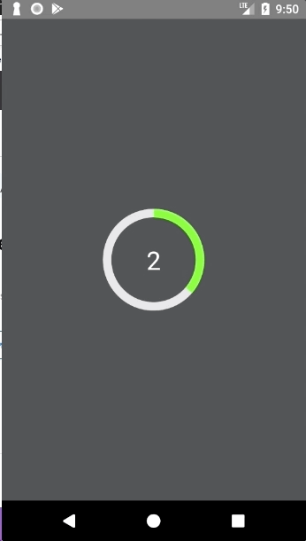
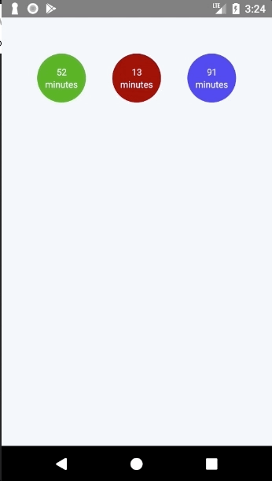

# React Native Radial Counter
An interactive circular progress ring which counts how often the user filled it (reached 100%).
The progress ring and the interactive component can be used separately.
So if you are just in a search for a progress ring you can use this one as well.

I use it in my application to have a fast, intuitive way to set a time interval.
(100% equals 30 minutes, thus if the user reaches "150%" a interval of 45 minutes is set.

 

All props for the filling circle goes to [Greg Douglas](https://codepen.io/xgad/post/svg-radial-progress-meters).

# Installation
```
yarn add react-native-radial-counter
```

# Usage Example
```
<RadialCounter
    containerStyle={styles.svgContainer}
    longPressDelay={300}
    backgroundColor={"#e6e6e6"} tintColor={"#6df732"}
    innerRadius={50} outerRadius={60}
    progress={this.state.ringProgress}
    timesRounded={this.state.timesRounded}
    onTimesRoundedChange={(timesRounded) =>
        this.setState(o => {
            return {timesRounded: Math.max(timesRounded, 0)}
        })}
    onRingProgressChange={(ringProgress) =>
        this.setState(o => {
            return {ringProgress}
        })}/>
```


# Components

## LoadingRing
Non interactive progress ring.

### Props:
* backgroundColor: [string] Background color of the ring
* tinColor: [string] Tint color of the ring
* innerRadius: [number] Radius to the inner bounding of the ring
* outerRadius: [number] Radius to the outer bounding of the ring
* progress: [number] Amount the ring is filled [0-1]

## RadialCounter
Interactive version of the progress ring. This is a controlled component.

### Props:
* backgroundColor: [string] Background color of the ring
* tinColor: [string] Tint color of the ring
* innerRadius: [number] Radius to the inner bounding of the ring
* outerRadius: [number] Radius to the outer bounding of the ring
* progress: [number] Amount the ring is filled [0-1]
* containerStyle: [object] Style object for touch receiving container
* longPressDelay: [number] Delay until touch is recognized for controlling the ring (ms).
* timesRounded: [number] Times the ring was filled
* onTimesRoundedChange: [function] Called when the 100% mark is reached. Passed parameter is an integer.
* onRingProgressChange: [function] Called when the ring progress changes. Passed parameter reaches from 0.0-1.0.
* buttonOptions: [buttonOptions]

### ButtonOptions:
* useButton: [boolean] If the ring only appears when a button in the rings center is pressed
* gap: [number] Gap between button and ring,
* buttonColor: [string] color of the button,
* buttonActiveColor: [string] color the button gets when active